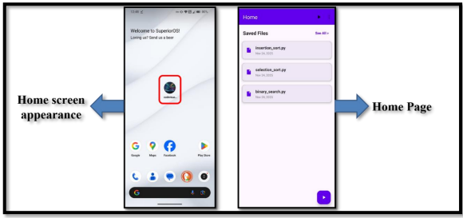
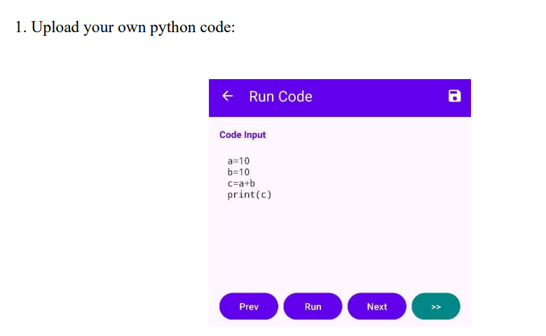
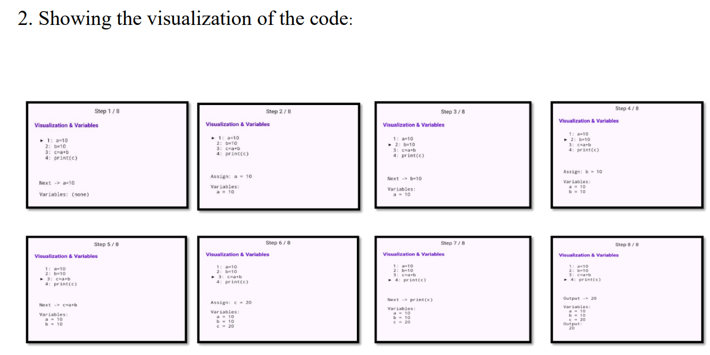
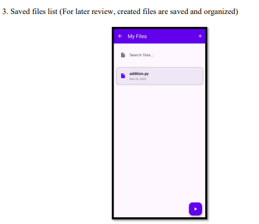
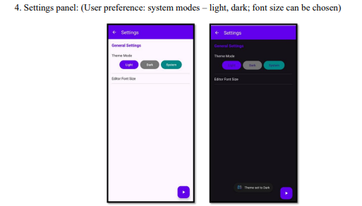

VisuCode – Python Code Visualizer
GitHub Badges
Add these badges at the top of your GitHub README to make the project look professional.

Project Overview
VisuCode is a web‑based Python Code Visualizer that helps users understand how Python programs execute step‑by‑step. It visually represents variable changes, memory updates, and execution flow to make programming easier to learn for beginners.
Project Architecture Diagram
Frontend (React / HTML / CSS)
        |
        |  Sends Python Code
        v
Backend API (Flask / FastAPI)
        |
        |  Executes Code + Tracks Variables
        v
Execution Engine
        |
        |  Sends Execution Steps
        v
Frontend Visualization (Variables, Flow, Output)
Execution Flow Diagram
1. User writes Python code in the editor
2. Code is sent to the backend server
3. Backend executes the code step‑by‑step
4. Variable states and execution steps are captured
5. Data is returned to the frontend
6. Frontend visualizes execution and variable updates
GIF Demo of the Project
Add a GIF recording of your project running. Example README syntax:

# VisuCode – Python Code Visualizer

## Features
- Step‑by‑step Python execution
- Variable visualization
- Beginner friendly learning tool

## VisuCode – Project Screenshots 

1. Application Launch & Home Screen
When the application is launched, the VisuCode icon appears on the device home screen. Opening the application takes the user to the Home Page where previously saved Python files are displayed. This page acts as the main dashboard of the application, allowing users to quickly access saved programs or create new ones.

2. Code Input & Execution Interface
This screen allows users to write or upload Python code and execute it. The interface includes controls such as Run, Previous, and Next buttons that allow step‑by‑step navigation through the program execution. This makes it easier for beginners to understand how the code is processed.

3. Step‑by‑Step Code Visualization
The core functionality of VisuCode is the visualization of Python code execution. Each step of the program execution is displayed along with the corresponding variable states. This helps users observe how variables change during execution and understand the logic of the program.

4. Saved Files Management
VisuCode allows users to save their Python scripts for future use. The saved files screen displays previously stored programs and provides a search option to easily locate files. This helps users organize their work and review programs later.

5. Settings Panel
The settings panel allows users to customize the application interface. Users can switch between light mode, dark mode, or system theme. Additionally, the editor font size can be adjusted to improve readability and user comfort.

## Architecture
Frontend → Backend → Execution Engine → Visualization

## Team Members
- Philis Jude. V
- T. Rajesh
- C. S. Sanjay Kumar

